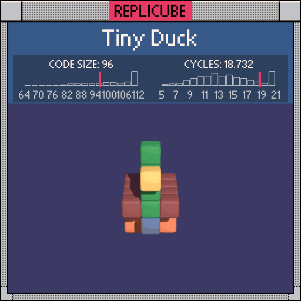

```lua
-- beak
if x == 0 and y == 2 and z == 2 then
  return 9
end

-- neck
if x == 0 and y >= 0 and z == 1 then
  return 11
end

-- belly
if x == 0 and y == -1 and inrange(z, -2, 1) then
  return 2
end

-- body
if abs(x) + abs(y) <= 1 and inrange(z, -2, 1) then
  return 15
end

-- legs
if abs(x) == 1 and z == -1 and inrange(y, -2, -1) then
  return 8
end
```
