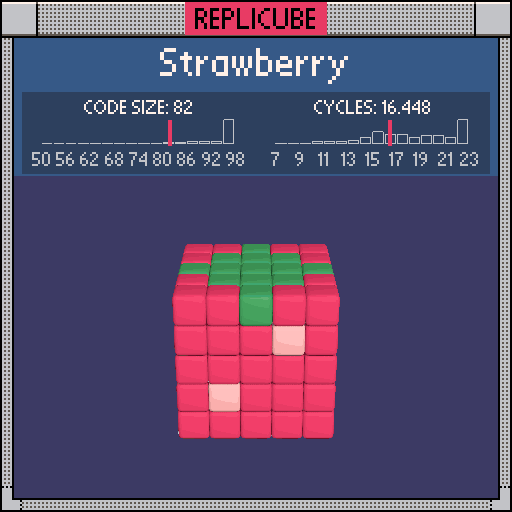

```lua
if y == 2 and abs(x) + abs(z) < 3 then
  return 11
end

if
  abs(x) < 2 and abs(y) < 2 and abs(z) < 2
  or x == 1 and y == 1
  or x == -1 and y == -1
  or x == 0 and z == -1
  or x == 1 and z == 1
  or y == 0 and z == 0
then
  return 4
end

return 7
```
