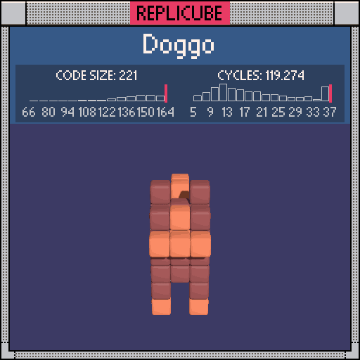

```lua
function box(cx, cy, cz, sx, sy, sz)
  local d =
    max(max(abs(x - cx) - sx / 2, abs(y - cy) - sy / 2), abs(z - cz) - sz / 2)
  return d <= 0
end

body = box(0, -0.5, -0.5, 3, 2, 6)
head = box(0, 1.5, 1.5, 3, 2, 2)
symmetry = abs(x) == 1
ears = symmetry and y == 3 and z == 1
paws = symmetry and y == -3 and (z == 2 or z == -3)
legs = symmetry and y == -2 and (z == 2 or z == -3)
snout = abs(x) < 2 and y == 1 and z == 3
forehead = x == 0 and inrange(y, 1, 2) and z == 2
tail = x == 0 and (inrange(y, 1, 2) and z == -3 or y == 2 and z == -2)

if snout or forehead or paws or tail then
  return 8
end

if body or head or ears or legs then
  return 15
end
```
