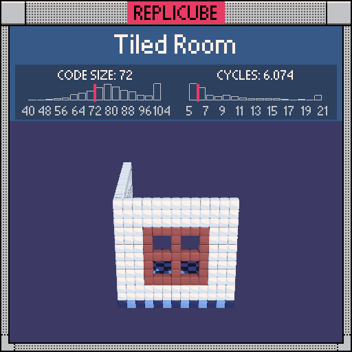

```lua
if y == -6 then
  return 12 + (x + z) % 2 * 2
end

if x == -6 then
  return 1
end

if z == 6 then
  ax = abs(x)
  ay = abs(y)

  if ax > 3 or ay > 3 then
    return 1
  elseif ax == 0 or ax == 3 or ay == 0 or ay == 3 then
    return 15
  end
end
```
