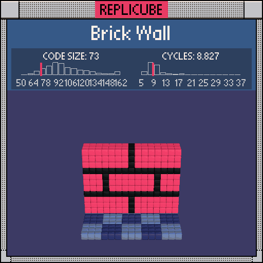

```lua
if y == -7 then
  return 2 + ((x + 1) // 3 + (z + 1) // 3) % 2 * 10
end

if y < 5 and abs(z) < 2 then
  if (y + 3) % 4 == 0 or (x + 4 * ((y + 6) // 4 % 2)) % 8 == 0 then
    return 3
  end

  return 7
end
```
