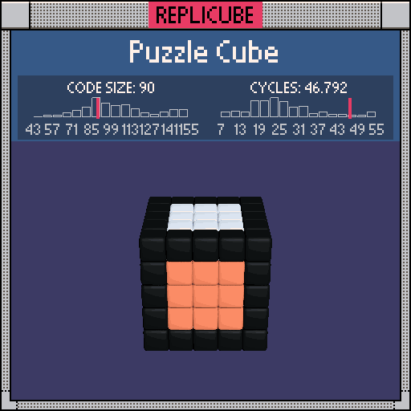

```lua
xx = btoi(abs(x) == 2)
yy = btoi(abs(y) == 2)
zz = btoi(abs(z) == 2)
sum = xx + yy + zz

if sum > 0 then
  if sum > 1 then return 3 end
  if x == 2 then return 11 end
  if x == -2 then return 14 end
  if y == 2 then return 1 end
  if y == -2 then return 9 end
  if z == 2 then return 8 end
  return 7
end
```
