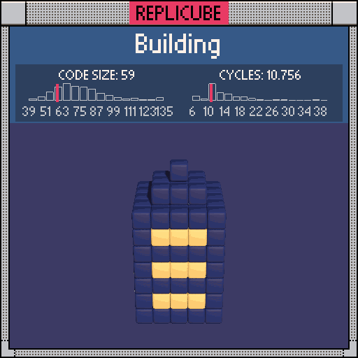

```lua
if y > 1 then
  if y + abs(x) < 5 and y + abs(z) < 5 then
    return 12
  end
elseif abs(x) < 3 and abs(z) < 3 then
  if y % 2 == 1 then
    if abs(x) == abs(z) then
      return 12
    end

    return 9
  end

  return 12
end
```
